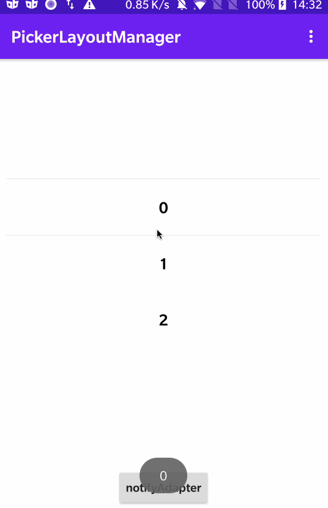
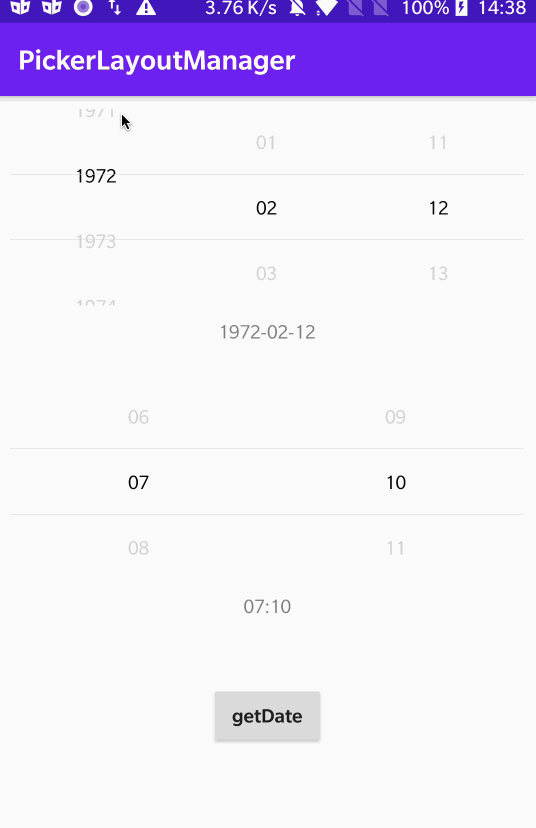

# PickerLayoutManager

一个基于自定义LayoutManager的PickerView，可定制化极高。

## DatePickerView和TimePickerView

### 支持的属性和方法

| 属性        | 方法 | 注释 |
| ------------------- | ------------- | ---- |
| visibleCount        | setVisibleCount | 显示多少个子View |
| isLoop              | setIsLoop | 是否支持无限滚动 |
| scaleX              | setItemScaleX | x轴缩放的比例 |
| scaleY              | setItemScaleY | y轴缩放的比例 |
| alpha               | setItemAlpha | 未选中item的透明度 |
| dividerVisible      | setDividerVisible | 分割线是否可见 |
| dividerColor        | setDividerColor | 分割线的颜色 |
| dividerSize         | setDividerSize | 分割线的大小 |
| dividerMargin       | setDividerMargin | 分割线的边距 |
| selectedTextColor   | setSelectedTextColor | 文字选中的颜色 |
| unSelectedTextColor | setUnSelectedTextColor | 文字未选中的颜色 |
| selectedTextSize    | setSelectedTextSize | 文字选中的大小 |
| unSelectedTextSize  | setUnSelectedTextSize | 文字未必选中的大小 |
| selectedIsBold      | setSelectedIsBold | 文字选中是否加粗 |
| scrollToEnd         | scrollToEnd() | 是否滚动到底部 |

